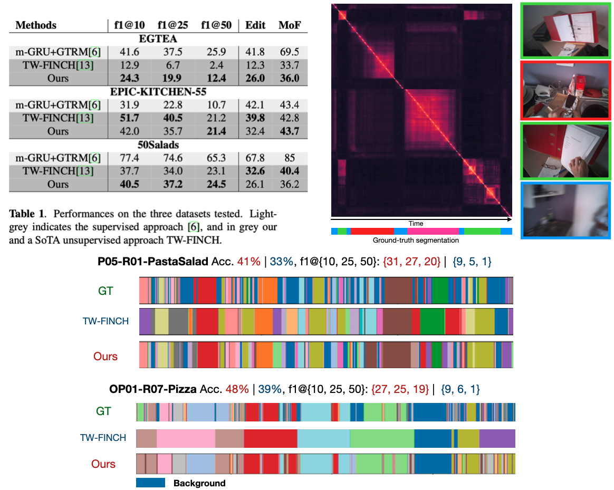
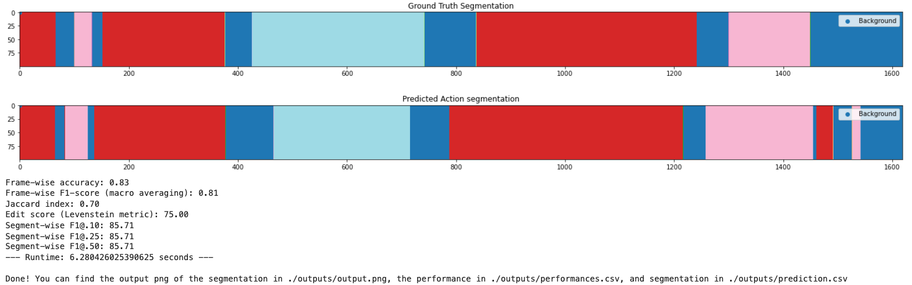

# Unsupervised Action segmentation of Untrimmed Egocentric Videos
This is the official implementation of our paper "Unsupervised Action segmentation of Untrimmed Egocentric Videos", submitted to ICASSP2023.


The unsupervised temporal segmentation of actions in videos aims at estimating the temporal boundaries and action classes of each actions occuring in a video. This work focus on the specificities of egocentric (or third-person view) videos to perform the task, and showed state-of-theart results on three benchmarked dataset, EGTEA, EPIC-KITCHEN-55, and the third-person view dataset 50Salads. 

We start by extracting frame-level features using a Resnet152 and perform a first step of background detections. We then use a kernel change points detection algorithm to find action boudaries within inlier segments of the video. The segments are then clustered into action classes using K-Means. We finally apply a segment-wise outlier detection step based on a clustering quality score to remove the remaining background segments.



# Basic Usage


## Requirements:
```
numpy==1.21.2
Pillow==9.0.0
torch==1.9.1
torchvision==0.10.1
matplotlib==3.5.3
seaborn==0.11.2
scikit-learn==1.0.2
imageio-ffmpeg==0.4.7
ruptures==1.1.5
pandas==1.3.5
```


### From command line

There are three arguments  (`--video_path`, `--ground_truth_path`, `--num_actions`).
- `--video_path` (default: './data/sample_video.mp4'): Path of the input video.
- `--ground_truth_pat` (default: ./data/sample_video_ground_truth.mp4'): Path to the csv file ocntaining the ground truth segmentation. Optional
- `--num_actions` (int, default: None): Number of actions in the video. Ignore this argument if a ground truth segmentation is provided.

```bash
python main.py --video_path your_path.mp4 --ground_truth_path your_pground_truth_path_if_any.csv --num_actions number_of_actions
```

### Python script or noteboook


The following snippet perform the temporal segmentation of the sample video located in `./data/sample_video.mp4`.
It uses the ground-truth segmentation `./data/sample_video_ground_truth.mp4` to compute performances.

```python
import os
import numpy as np
import pandas as pd
import os
import warnings
import time

# Import our own algorithms
from src.dataset import VideoFrameDataset
from src.pipeline import Pipeline
from src.metrics import Annotation
from src.const import DEFAULT_CONFIG

#### Segmentation of a sample video
video_path = './data/sample_video.mp4'
ground_truth_path = './data/sample_video_ground_truth.csv'
feature_vectors_path = './data/sample_video_features.npy'

start_time = time.time()

# Create the video dataset
dataset = VideoFrameDataset(filename=video_path, config=DEFAULT_CONFIG)

# Create the ground truth and metrics computation object
annotation = Annotation()
if ground_truth_path is not None:
    df = pd.read_csv(ground_truth_path)
    annotation.populate_ground_truth(df, dataset.n_frames)

# Create the pipeline object
pipeline = Pipeline(dataset=dataset, annotation=annotation, config=DEFAULT_CONFIG, verbosity=0)

# Compute frame embedding
pipeline.compute_embedding(path=feature_vectors_path)

# Do thte background extraction
pipeline.outlier_methods = ['custom', 'silhouette_score']
pipeline.remove_outliers_method()

# Calibration of the lambda parameter 
regularization_lambda = int(10*3000/dataset.n_frames)

# Detect ruptures
pipeline.detect_ruptures(penalty=regularization_lambda, ruptures_on = 'embedding_ts', remove_outliers=True, verbose=False)

# Take as number of cluster the number of different actions in the ground truth
num_clusters = len(np.unique(annotation.gt_label)) - 1

# Cluster non-background segments
pipeline.cluster_frames(n_clusters=num_clusters, method='kmeans')

# Compute metrics and plot results
pipeline.annotation.compute_metrics()
pipeline.annotation.plot()
pipeline.annotation.compute_metrics()

# Create outputs
pipeline.create_outputs()
```




## Contact

If you have any suggestions, remarks, or want to report a bug, feel free to contact me at sam.perochon@ens-paris-saclay.fr.
