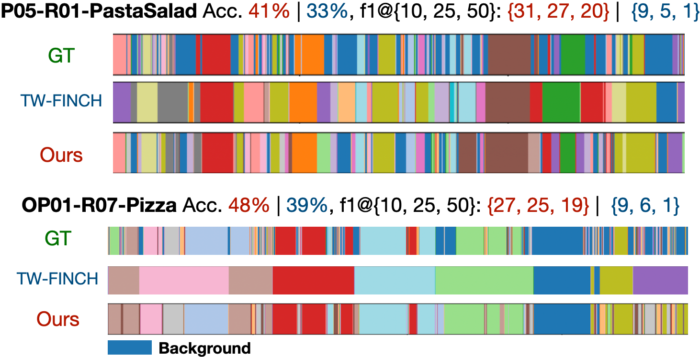
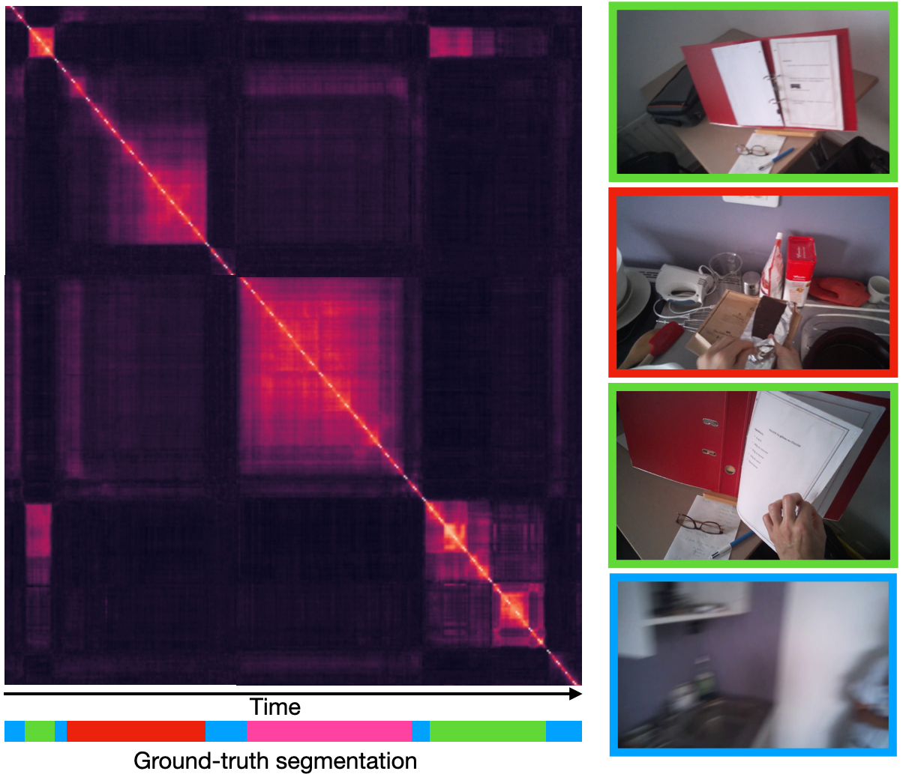

# Unsupervised Action segmentation of Untrimmed Egocentric Videos
This is the official implementation of our paper "Unsupervised Action segmentation of Untrimmed Egocentric Videos", submitted to ICASSP2023.

The unsupervised temporal segmentation of actions in videos aims at estimating the temporal boundaries and action classes of each actions occuring in a video. This work focus on the specificities of egocentric (or third-person view) videos to perform the task, and showed state-of-theart results on three benchmarked dataset, EGTEA, EPIC-KITCHEN-55, and the third-person view dataset 50Salads. 

We start by extracting frame-level features using a Resnet152 and perform a first step of background detections. We then use a kernel change points detection algorithm to find action boudaries within inlier segments of the video. The segments are then clustered into action classes using K-Means. We finally apply a segment-wise outlier detection step based on a clustering quality score to remove the remaining background segments.

## Basic Usage

### From command line

To come soon. 

### Python script or noteboook

To come soon. 

## Contact

If you have any suggestions, remarks, or want to report a bug, feel free to contact me at sam.perochon@ens-paris-saclay.fr.
